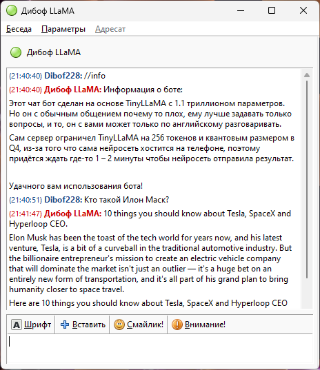

# LLaMAxmpp
Чат бот LLaMA для XMPP на языке программиярования python  
 
Демонстрация работы LLaMAxmpp на основе языковой модели TinyLLaMA 
# Установка LLaMAxmpp:
Для установки LLaMAxmpp потребуется:
<ol>
  <li>Установить для python пакеты: <code>slixmpp llama-cpp-python translate langdetect</code> (Работает только на Линуксе)</li>
  <li>Скачать с https://huggingface.co или с другого источника языковую модель LLaMA или другую с расширением .gguf, .ggml или .bin</li>
</ol>
